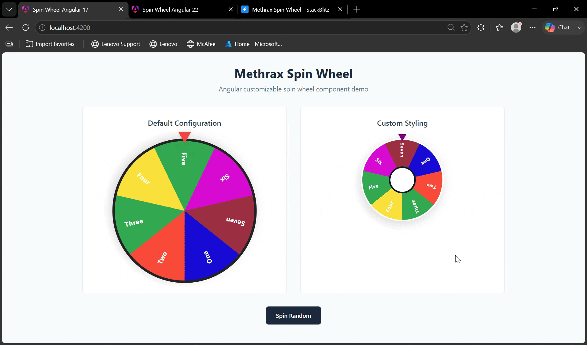

# Methrax Spin Wheel

A highly customizable, lightweight, and framework-native **Angular 17+ Spin Wheel component** built with modern Angular features including:

- Standalone Components
- Angular Signals
- Signal Inputs / Outputs
- Computed State
- CSS Custom Properties (Design Tokens)
- No external dependencies

Create interactive prize wheels, decision wheels, random selectors, game wheels, and custom spinning experiences with complete styling control.

### Interactive Demo

[](https://stackblitz.com/edit/stackblitz-starters-alrarbnu?file=src%2Fmain.ts)



---

## Features

✅ Angular 17+ compatible  
✅ Standalone component architecture  
✅ Signal-based reactive state management  
✅ Fully customizable design tokens  
✅ Dynamic sector generation  
✅ Random spinning  
✅ Spin to specific result  
✅ Custom center pin  
✅ Custom sector colors  
✅ Custom label styling  
✅ Smooth configurable animations  
✅ Library consumer theme overrides  
✅ Zero third-party dependencies  

---

## Installation

Install the package using npm:

```bash
npm install @methrax/spin-wheel
````

---

## Usage

### Import Component

Since this library uses standalone components, import it directly into your Angular component.

```typescript
import { MethraxSpinWheel } from '@methrax/spin-wheel';

@Component({
  selector: 'app-example',
  standalone: true,
  imports: [
    MethraxSpinWheel
  ],
  templateUrl: './example.component.html'
})
export class ExampleComponent {

}
```

---

## Basic Example

### Component Template

```html
<m-spin-wheel
  [sectors]="wheelSectors"
  [numberOfSpinnings]="5"
  [spinDuration]="4000"
  (spinComplete)="onSpinComplete($event)">
</m-spin-wheel>
```

---

### Component Code

```typescript
import { Component } from '@angular/core';
import { WheelSector } from '@methrax/spin-wheel';

@Component({
  selector: 'app-example',
  templateUrl: './example.component.html'
})
export class ExampleComponent {

  wheelSectors: WheelSector[] = [
    {
      id: 1,
      label: 'Prize 1',
      color: '#ef4444'
    },
    {
      id: 2,
      label: 'Prize 2',
      color: '#22c55e'
    },
    {
      id: 3,
      label: 'Prize 3',
      color: '#3b82f6'
    },
    {
      id: 4,
      label: 'Prize 4',
      color: '#eab308'
    }
  ];


  onSpinComplete(result: WheelSector) {
    console.log('Winner:', result);
  }

}
```

---

# Component API

## Inputs

| Input               | Type            | Default   | Description                                  |
| ------------------- | --------------- | --------- | -------------------------------------------- |
| `sectors`           | `WheelSector[]` | Required  | Wheel sector configuration                   |
| `numberOfSpinnings` | `number`        | `2`       | Number of complete rotations before stopping |
| `spinDuration`      | `number`        | `5000`    | Animation duration in milliseconds           |
| `centerPinLabel`    | `string`        | undefined | Text displayed inside center pin             |
| `showCenterPin`     | `boolean`       | `false`   | Display center pin                           |

---

## Outputs

| Output         | Type          | Description                     |
| -------------- | ------------- | ------------------------------- |
| `spinStart`    | `void`        | Fired when spinning starts      |
| `spinComplete` | `WheelSector` | Fired when wheel reaches result |

---

# Public Methods

The component exposes methods that can be accessed using Angular ViewChild.

---

## Spin To Specific Result

```typescript
@ViewChild(MethraxSpinWheel)
wheel!: MethraxSpinWheel;


spinWinner() {
  this.wheel.spinToResult(2);
}
```

The wheel will rotate and stop on the sector matching the provided ID.

---

## Spin Randomly

```typescript
spinRandom() {
  this.wheel.spinRandom();
}
```

Selects a random sector and animates the wheel.

---

# Sector Model

```typescript
export interface WheelSector {

  id: string | number;

  label: string;

  color: string;

  textColor?: string;

}
```

Example:

```typescript
{
  id: "gold",
  label: "Gold Prize",
  color: "#facc15",
  textColor: "#000000"
}
```

---

# Customization

The component exposes CSS Custom Properties allowing complete theme customization.

Override tokens from the consumer application:

```css
m-spin-wheel {

  --m-wheel-size: 450px;

  --m-wheel-border-size: 8px;
  --m-wheel-border-color: #111827;

  --m-wheel-shadow:
    0 15px 40px rgba(0,0,0,0.25);


  --m-wheel-pointer-color: #dc2626;


  --m-wheel-label-font-size: 18px;
  --m-wheel-label-font-weight: 800;


  --m-wheel-center-pin-size: 80px;
  --m-wheel-center-pin-background: #ffffff;
  --m-wheel-center-pin-color: #111827;

}
```

---

# Available CSS Design Tokens

### Wheel

| Token | Default | Description |
|-------|---------|-------------|
| `--m-wheel-size` | `350px` | Overall wheel diameter |
| `--m-wheel-background` | `transparent` | Wheel background |
| `--m-wheel-border-size` | `6px` | Wheel border width |
| `--m-wheel-border-color` | `#222222` | Wheel border color |
| `--m-wheel-border-radius` | `50%` | Wheel border radius |
| `--m-wheel-box-sizing` | `border-box` | CSS box-sizing used for wheel layout |
| `--m-wheel-shadow` | `0 8px 24px rgba(0, 0, 0, 0.15)` | Wheel shadow |

---

### Animation

| Token | Default | Description |
|-------|---------|-------------|
| `--m-wheel-transition-duration` | `5000ms` | Spin animation duration |
| `--m-wheel-transition-timing-function` | `cubic-bezier(0.1, 1, 0.1, 1)` | Spin animation easing function |

---

### Pointer

| Token | Default | Description |
|-------|---------|-------------|
| `--m-wheel-pointer-size` | `16px` | Pointer triangle size |
| `--m-wheel-pointer-color` | `#ef4444` | Pointer color |
| `--m-wheel-pointer-angle` | `0deg` | Pointer rotation angle |
| `--m-wheel-pointer-shadow` | `drop-shadow(0 2px 4px rgba(0, 0, 0, 0.15))` | Pointer shadow |

---

### Labels

| Token | Default | Description |
|-------|---------|-------------|
| `--m-wheel-label-font-family` | `system-ui, -apple-system, sans-serif` | Label font family |
| `--m-wheel-label-font-size` | `1rem` | Label font size |
| `--m-wheel-label-font-weight` | `700` | Label font weight |
| `--m-wheel-label-color` | `inherit` | Default label text color |
| `--m-wheel-label-letter-spacing` | `0.5px` | Label letter spacing |
| `--m-wheel-label-offset` | `-0.36` | Label radial offset from the wheel center (multiplier of wheel size) |
| `--m-wheel-label-rotation` | `90deg` | Label text rotation |

---

### Center Pin

| Token | Default | Description |
|-------|---------|-------------|
| `--m-wheel-center-pin-size` | `65px` | Center pin diameter |
| `--m-wheel-center-pin-background` | `#ffffff` | Center pin background |
| `--m-wheel-center-pin-color` | `#0f172a` | Center pin text color |
| `--m-wheel-center-pin-border-width` | `4px` | Center pin border width |
| `--m-wheel-center-pin-border-color` | `#0f172a` | Center pin border color |
| `--m-wheel-center-pin-border-radius` | `50%` | Center pin border radius |
| `--m-wheel-center-pin-font-size` | `11px` | Center pin font size |
| `--m-wheel-center-pin-font-weight` | `900` | Center pin font weight |
| `--m-wheel-center-pin-shadow` | `none` | Center pin shadow |
| `--m-wheel-center-pin-z-index` | `5` | Center pin stacking order |

---

# Browser Support

Supported browsers:

* Chrome
* Edge
* Firefox
* Safari

Requires:

```
Angular >= 17
```

---

# Architecture

The component is built using modern Angular principles:

```
MethraxSpinWheel

├── Signal Inputs
│
├── Computed State
│   ├── Slice Calculation
│   ├── Gradient Generation
│   └── Label Positioning
│
├── Animation Engine
│
├── CSS Token System
│
└── Public Component API
```

---

# Design Philosophy

The component follows these principles:

* **Configuration over modification**
* **CSS variables over style overrides**
* **Signals over RxJS for local state**
* **Standalone Angular architecture**
* **Zero dependency footprint**

---

# Development

Clone repository:

```bash
git clone https://github.com/methrax/spin-wheel.git
```

Install dependencies:

```bash
npm install
```

Run development server:

```bash
npm start
```

Build library:

```bash
ng build
```

---

# License

MIT License

Copyright (c) Methrax

---

# Author

**Tharaka Madhusanka @ Methrax**

Built with ❤️ using Angular 22
